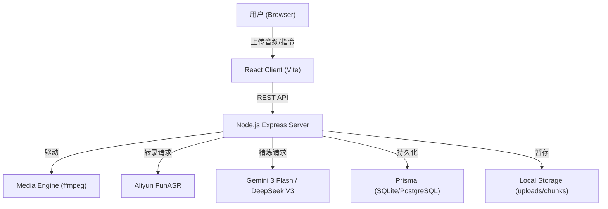

# AudioScribe Pro: 技术架构文档 (Architecture)

本文档旨在帮助开发者理解 AudioScribe Pro 的核心设计理念、数据流转以及各模块的实现细节。

## 1. 系统概览

AudioScribe Pro 采用典型的 **C/S 架构**（客户端/服务器），并集成了阿里云与 Google/DeepSeek 的云端 AI 能力。

## 2. 核心技术组件

### 2.1 后端服务 (Server)
- **Express**: 构建高性能 RESTful API。
- **Prisma**: ORM 框架，目前使用 SQLite 作为本地存储，支持无缝迁移至 PostgreSQL。
- **Media Processing**: 
    - 使用 `ffmpeg` 进行音频强制压缩（48kbps 单声道）以平衡传输速度与识别率。
    - 实现 **VAD (Voice Activity Detection)** 逻辑，支持按静音点自动切片音频。
- **Solo Mode Pipeline**: 
    - 采用顺序执行逻辑：`上传 -> 压缩 -> 切分 -> 串行转录 -> 串行精炼 -> 自动合并`。
    - **隔离存储**：每个项目拥有独立的目录，防止切片文件名冲突。

### 2.2 前端工程 (Client)
- **Vite + React**: 极速构建与热更新。
- **TailwindCSS**: 现代化的 UI 样式方案。
- **State Management**: 使用 React Hooks (useState/useEffect) 管理轻量级状态。
- **Workspace**: 沉淀了双栏对比、实时差异渲染（Diff）等高交互组件。

## 3. 关键业务流程

### 3.1 提示词隔离机制 (Prompt Isolation)
由于用户经常提供复杂的自定义模板，为了防止系统内置指令干扰输出结果，我们实现了 **Strict Protocol** 模式。
- 当检测到用户模板包含层级标题（`#`）时，系统会自动抑制背景 Persona，强制 AI 100% 遵循用户定义的格式与语境。

### 3.2 负载均衡与重试
- **多 Key 轮询**：支持配置多个 DeepSeek API Key，内部通过简单的负载均衡器（Load Balancer）进行轮询请求。
- **重试机制**：在发生 429 (Rate Limit) 或网络波动时，支持单块（Chunk）级的手动重试。

## 4. 数据目录结构

- `server/storage/uploads/`: 存放所有音频资产。
- `server/storage/uploads/[projectId]/`: 项目隔离目录。
- `server/storage/uploads/[projectId]/chunks/`: VAD 切片存储。
- `server/storage/settings.json`: 存储全局系统配置（API Keys, 自定义模板）。

## 5. 扩展性设计

- **ASR Provider**: 目前硬编码了 Aliyun，但通过 `transcribeService` 层进行了抽象，未来可接入 OpenAI Whisper 或腾讯云。
- **Polisher Engine**: 支持在 Gemini 3 Flash 与 DeepSeek V3 之间动态切换。
